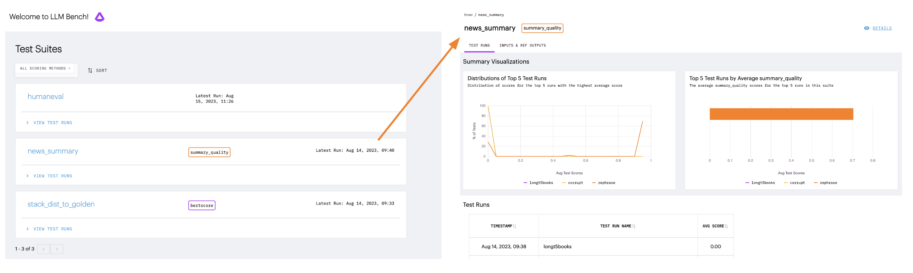

# Bench

Bench is a tool for evaluating LLMs for production use cases. Whether you are comparing different LLMs, considering different prompts, or testing generation hyperparameters like temperature and # tokens, Bench provides one touch point for all your LLM performance evaluation.

If you have encountered a need for any of the following in your LLM work, then Bench can help with your evaluation:

- to standardize the workflow of LLM evaluation with a common interface across tasks and use cases
- to test whether open source LLMs can do as well as the top closed-source LLM API providers on your specific data
- to translate the rankings on LLM leaderboards and benchmarks into scores that you care about for your actual use case

Join the bench community on [Discord](https://discord.gg/tdfUAtaVHz).

For bug fixes and feature requests, please file a Github issue.

## Package installation

Install Bench to your python environment with optional dependencies for serving results locally (recommended):
`pip install 'arthur-bench[server]'`

Alternatively, install Bench to your python environment with minimum dependencies:
`pip install arthur-bench`

For further setup instructions visit our [installation guide](https://bench.readthedocs.io/en/latest/setup.html)

## Using Bench

For a more in-depth walkthrough of using bench, visit our [quickstart walkthrough](https://bench.readthedocs.io/en/latest/quickstart.html) and our [test suite creation guide](https://bench.readthedocs.io/en/latest/creating_test_suites.html) on our docs.

To make sure you can run test suites in bench, you can run the following code snippets to create a test suite and run it to give a score to candidate outputs.

```python
from arthur_bench.run.testsuite import TestSuite
suite = TestSuite(
    "bench_quickstart",
    "exact_match",
    input_text_list=["What year was FDR elected?", "What is the opposite of down?"],
    reference_output_list=["1932", "up"]
)
suite.run("quickstart_run", candidate_output_list=["1932", "up is the opposite of down"])
```

Saved test suites can be loaded later on to benchmark test performance over time, without needing to re-prepare reference data:

```python
existing_suite = TestSuite("bench_quickstart", "exact_match")
existing_suite.run("quickstart_new_run", candidate_output_list=["1936", "up"])
```

To view the results for these runs in the local UI that comes with the `bench` package, run `bench` from the command line (this requires the bench optional server dependencies to be installed):

```
bench
```

Viewing examples in the bench UI will look something like this:
<p align="center">


## Running Bench from source

To launch Bench from source:

1. Install the dependencies
    * `pip install -e '.[server]'`
2. Build the Front End
    * `cd arthur_bench/server/js`
    * `npm i`
    * `npm run build`
3. Launch the server
    * `bench`

Because the server was installed with `pip -e`, local changes will be picked up. However, the server will need to be restarted between
changes in order for those changes to be picked up.

