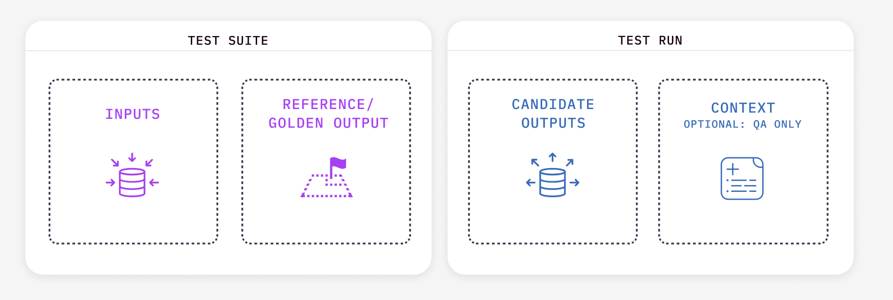
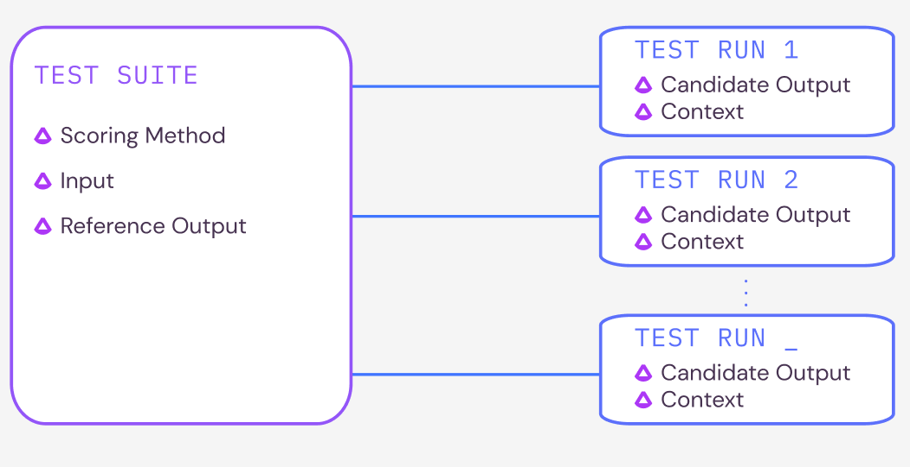

## Key Concepts
### Data
<!--  -->
<p align="center">


Using Bench requires a reference dataset, including information such as:
- **Inputs** to the LLM. For *Summarization* tasks, this may be the document to be summarized. For *Question & Answering* tasks, this may be the question asked.
- **Reference Outputs**: these are your baseline outputs. Teams can use either human-labeled ground truth annotations or the outputs from your LLM model in production that you are using Bench to compare against.
- **Candidate Outputs**: these are the outputs from your new candidate LLM.
- **Context**: contextual information for Question & Answering tasks.

[//]: # (TODO: are the latter  two part of the reference dataset?)

#### An Example

Consider the task of *Question & Answering* about specific documents: 

 - **Input**: "What war was referred to in the Gettysburg Address?"
 - **Reference Output**: The American Civil War
 - **Candidate Output**: The American War
 - **Context**: _(The Gettysburg Address)_ "Four score and seven years ago our fathers brought forth on this continent, a new nation, conceived in Liberty, and dedicated to the proposition that all men are created equal ... that this nation, under God, shall have a new birth of freedom – and that government of the people, by the people, for the people, shall not perish from the earth."

### Testing Structure
 
 
<p align="center">


#### Test Suites

A **Test Suite** can hold Input data and Reference Outputs as well as a _Scoring Method_ which will be used to compare the reference outputs to the candidate outputs provided in each **Test Run**. 

For example, for a summarization task, your {class}`Test Suite <arthur_bench.run.testsuite.TestSuite>` might include the documents to summarize, desirable reference summaries, and the {class}`Summary Quality <arthur_bench.scoring.summary_quality.SummaryQuality>` scoring metric.

Reference data can be provided via csv file, a pandas dataframe, or lists of strings for inputs and reference outputs. To create a test suite in Bench:

```
from arthur_bench.run.testsuite import TestSuite

suite = TestSuite('my_bench_test', reference_data_path='./path/to/my_data.csv', scoring_method='bertscore')
```

#### Test Runs

A **Test Run** contains a set of Candidate Outputs and optional Context, and can additionally specify metadata which indicates how the candidate outputs were generated. For example, on the document summarization task, we might want to create a run to assess the responses of gpt 3.5, using prompt version `my_custom_prompt`.

To create a {class}`Test Run <arthur_bench.run.testrun.TestRun>`, you only need to specify the candidate responses (as a csv file, a pandas dataframe, or a list of strings) and Bench will score the run:

```
suite.run('my_bench_run', candidate_data_path='./path/to/my_model_data.csv', model_name='openai_gpt_35', foundation_model='gpt-3.5-turbo', prompt_template='my_custom_prompt')

```

### Viewing your runs

Running `bench` from the command line will spin up a local server where you can view your test suites, runs, and scores.
This will require bench optional server dependencies to be installed.

### Running an existing test suite
Saved test suites can be loaded for reuse by name, without needing to specify data again. 

```
my_existing_suite = TestSuite('my_bench_test', 'bertscore')
```

### Scoring Methods

A **Scoring Method** is the criteria used to judge the candidate outputs for each run of the test suite. Each {class}`scoring method <arthur_bench.scoring.scoring_method.ScoringMethod>` implements the `run_batch` method to compute a score for a model output. Bench includes both embedding based methods like bert score as well as LLM-guided evaluations.

| Scoring Method                    | Tasks | Requirements |
|-----------------------------------|-----|-----|
| BERT Score (`bertscore`)          | any | Reference Output, Candidate Output|
| Summary Quality (`summary_quality`)  | Summarization | Input, Reference Output, Candidate Output|
| QA Correctness (`qa_correctness`) | Question-Answering| Input, Candidate Output, Context|
| Exact Match (`exact_match`)       | any | Reference Output, Candidate Output|
| Readability (`readability`)       | any | Candidate Output |
| Word Count Match (`word_count_match`)   | any | Reference Output, Candidate Output |

#### `bertscore`

[BERTScore](https://arxiv.org/abs/1904.09675) is a quantitative metric to compare the similarity of two pieces of text. Using the `bertscore` scoring method will score each row of the test run as the bert score between the reference output and the candidate output.

#### `summary_quality`

The Summary Quality scoring method is a comprehensive measure of summarization quality compared to a reference. It evaluates summaries on dimensions including relevance and syntax. Each row of the test run will receive a binary 0, indicating that the reference output was scored higher than the candidate output, or 1, indicating that the candidate output was scored higher than the reference output.

#### `qa_correctness`

The QA correctness metric evaluates the correctness of an answer, given a question and context. This scoring method does not require a reference output, but does require context. Each row of the Test Run will receive a binary 0, indicating an incorrect output, or 1, indicating a correct output.

#### `exact_match`

The Exact Match metric evaluates whether the candidate output exactly matches the reference output. This is case sensitive. Each row of the Test Run will receive a binary 0, indicating a non-match, or 1, incidating an exact match.

#### `readability`

The Readability metric evaluates the reading ease of the candidate output according to the [Flesch Reading Ease Score](https://en.wikipedia.org/wiki/Flesch%E2%80%93Kincaid_readability_tests). The higher the score, the easier the candidate output is to read: scores of 90-100 correlate to a 5th grade reading level, while scores less than 10 are classified as being "extremely difficult to read, and best understood by university graduates."

#### `word_count_match`

For scenarios where there is a preferred output length, `word_count_match` calculates a corresponding score on the scale of 0 to 1. Specifically, this scoring method calculates how similar the number of words in the candidate output is to the number of words in the reference output, where a score of 1.0 indicates that there are the same number of words in the candidate output as in the reference output. Scores less than 1.0 are calculated as ((len_reference-delta)/len_reference) where delta is the absolute difference in word lengths between the candidate and reference outputs. All negative computed values are truncated to 0. 
    
#### `hedging_language`

The Hedging Language scoring method evaluates whether a candidate response is similar to generic hedging language used by an LLM ("As an AI language model, I don't have personal opinions, emotions, or beliefs"). Each row of the Test Run will receive a binary 0, indicating hedging language *not* used, or 1, indicating hedging language used.
